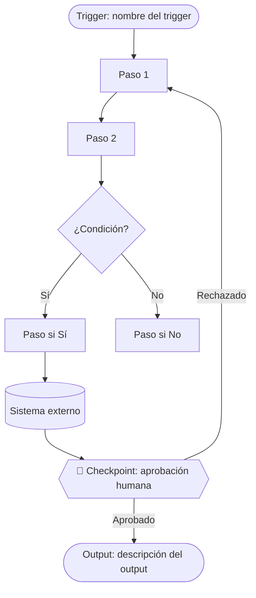
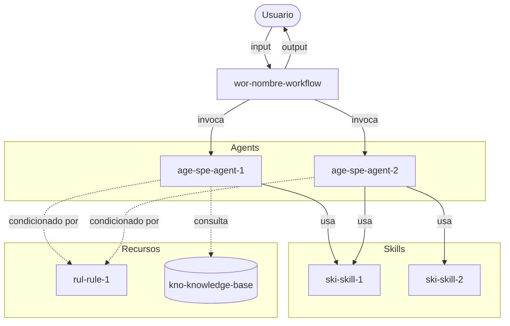
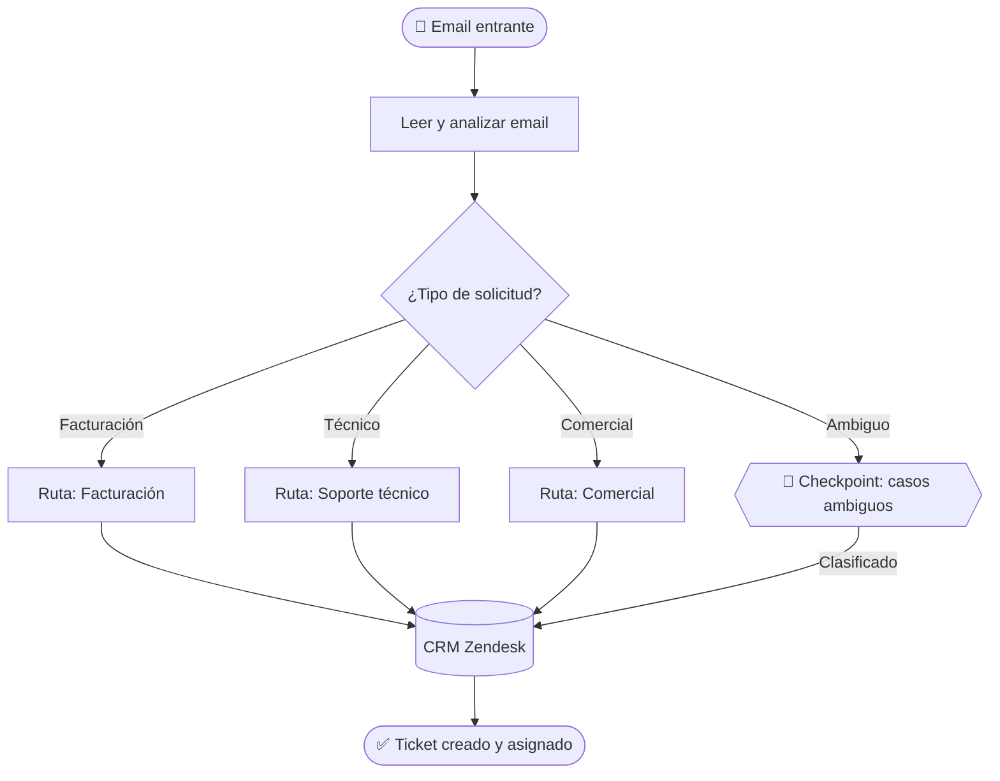

# Diagram Generator Skill

Genera diagramas en sintaxis Mermaid para representar procesos, flujos y arquitecturas de entidades agénticas. Los diagramas son importables directamente en draw.io/diagrams.net.

## Input / Output

**Input:**
- Tipo de diagrama a generar: `as-is` | `architecture` | `sequence` | `flow`
- Datos del proceso o arquitectura a representar (del JSON de handoff correspondiente)

**Output:**
- Bloque de código Mermaid listo para renderizar y exportar a draw.io

---

## Procedure

### 1. Selección del tipo de diagrama

| Tipo | Cuándo usarlo | Sintaxis Mermaid |
|---|---|---|
| `as-is` | Al cerrar el Step 1 para reflejar el proceso actual | `flowchart TD` |
| `architecture` | Al cerrar el Step 2 para mostrar entidades y relaciones | `flowchart TD` |
| `sequence` | Cuando el orden de interacciones entre entidades es crítico | `sequenceDiagram` |
| `flow` | Para el diagrama de flujo del `process-overview.md` | `flowchart TD` |

---

### 2. Convenciones de estilo

**Formas de nodos según su rol:**

```
([texto])   → Inicio / Fin (stadium shape)
[texto]     → Proceso / Entidad (rectángulo)
{texto}     → Decisión (rombo)
[(texto)]   → Base de datos / Sistema externo (cilindro)
((texto))   → Evento (círculo)
```

**Etiquetas de flechas:**

```
A -->|"acción o dato"| B     → flujo con etiqueta
A -.->|"opcional"| B         → flujo opcional o condicional
A ==>|"crítico"| B           → flujo principal o crítico
```

**Subgrafos para agrupar entidades relacionadas:**

```
subgraph "Nombre del grupo"
  entidad1
  entidad2
end
```

---

### 3. Construcción del diagrama AS-IS

Representa el proceso tal como fue descrito en el Step 1.

Estructura obligatoria:
1. Nodo de inicio con el trigger
2. Pasos del proceso como nodos rectangulares
3. Decisiones como nodos de rombo con las dos ramas etiquetadas
4. Sistemas externos como nodos cilíndricos
5. Checkpoints humanos con etiqueta explícita
6. Nodo de fin con el output

**Plantilla:**



---

### 4. Construcción del diagrama de arquitectura

Representa las entidades del Blueprint y sus relaciones.

Convención de prefijos en nodos para identificar tipo de entidad:

```
WF[wor-nombre]          → Workflow
AGS[age-spe-nombre]     → Agent Specialist
AGU[age-sup-nombre]     → Agent Supervisor
SK[ski-nombre]          → Skill
CMD[com-nombre]         → Command
RUL[rul-nombre]         → Rule
KB[(kno-nombre)]        → Knowledge-base
EXT[(Sistema externo)]  → Sistema externo
```

**Plantilla:**



---

### 5. Presentación al usuario

Siempre presenta el diagrama con:
1. Una línea de contexto: *"Este es el diagrama [tipo] del proceso [nombre]."*
2. El bloque de código Mermaid.
3. Una instrucción de importación: *"Para abrirlo en draw.io: Extras → Edit Diagram → pegar el código."*
4. La pregunta de validación: *"¿Refleja correctamente el [proceso / arquitectura]?"*

---

## Examples

**Ejemplo — Diagrama AS-IS de clasificación de emails**



---

## Error Handling

- **Diagrama demasiado complejo para renderizar:** Dividir en dos diagramas (uno por subproceso o por capa de arquitectura).
- **Nodo con nombre muy largo:** Acortar a un alias descriptivo en el nodo y añadir leyenda si es necesario.
- **El usuario indica que el diagrama no refleja el proceso:** Preguntar qué parte es incorrecta y corregir solo esa parte, no regenerar todo.
