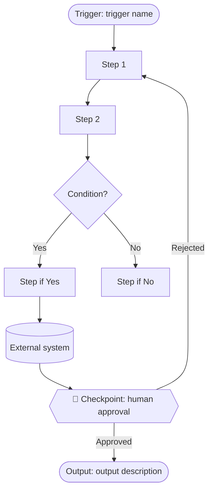
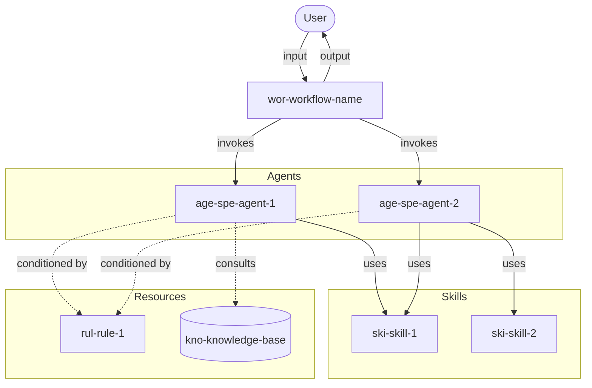
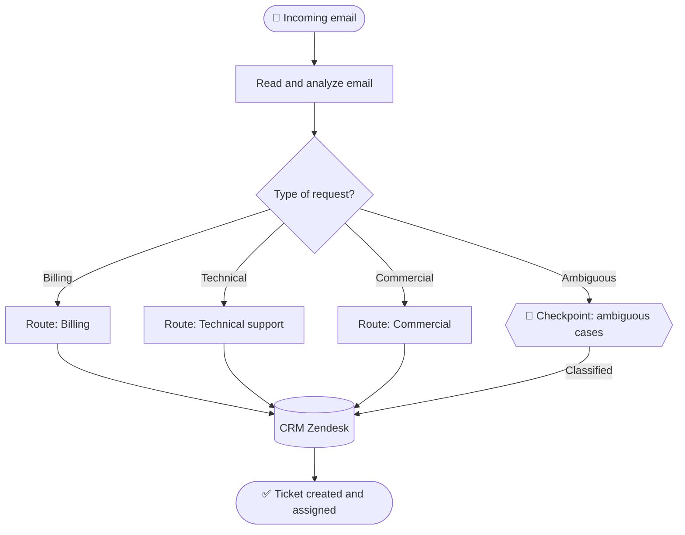

# Diagram Generator Skill

Generates diagrams in Mermaid syntax to represent processes, flows, and agentic entity architectures. Diagrams are importable directly into draw.io/diagrams.net.

## Input / Output

**Input:**

- Type of diagram to generate: `as-is` | `architecture` | `sequence` | `flow`
- Process or architecture data to represent (from the corresponding handoff JSON)

**Output:**

- Mermaid code block ready to render and export to draw.io

---

## Procedure

### 1. Diagram type selection

| Type           | When to use it                                              | Mermaid syntax    |
| -------------- | ----------------------------------------------------------- | ----------------- |
| `as-is`        | When closing Step 1 to reflect the current process          | `flowchart TD`    |
| `architecture` | When closing Step 2 to show entities and relationships      | `flowchart TD`    |
| `sequence`     | When the order of interactions between entities is critical | `sequenceDiagram` |
| `flow`         | For the flow diagram in `process-overview.md`               | `flowchart TD`    |

---

### 2. Style conventions

**Node shapes according to role:**

```
([text])   → Start / End (stadium shape)
[text]     → Process / Entity (rectangle)
{text}     → Decision (diamond)
[(text)]   → Database / External system (cylinder)
((text))   → Event (circle)
```

**Arrow labels:**

```
A -->|"action or data"| B     → flow with label
A -.->|"optional"| B          → optional or conditional flow
A ==>|"critical"| B           → main or critical flow
```

**Subgraphs for grouping related entities:**

```
subgraph "Group name"
  entity1
  entity2
end
```

---

### 3. AS-IS diagram construction

Represents the process as it was described in Step 1.

Required structure:

1. Start node with the trigger
2. Process steps as rectangular nodes
3. Decisions as diamond nodes with two labeled branches
4. External systems as cylindrical nodes
5. Human checkpoints with explicit label
6. End node with the output

**Template:**



---

### 4. Architecture diagram construction

Represents the Blueprint entities and their relationships.

Node prefix convention to identify entity type:

```
WF[wor-name]          → Workflow
AGS[age-spe-name]     → Agent Specialist
AGU[age-sup-name]     → Agent Supervisor
SK[ski-name]          → Skill
CMD[com-name]         → Command
RUL[rul-name]         → Rule
KB[(kno-name)]        → Knowledge-base
EXT[(External system)] → External system
```

**Template:**



---

### 5. Presentation to the user

Always present the diagram with:

1. A context line: _"This is the [type] diagram of the [name] process."_
2. The Mermaid code block.
3. An import instruction: _"To open it in draw.io: Extras → Edit Diagram → paste the code."_
4. The validation question: _"Does it correctly reflect the [process / architecture]?"_

---

## Examples

**Example — AS-IS diagram of email classification**



---

## Error Handling

- **Diagram too complex to render:** Split into two diagrams (one per sub-process or architecture layer).
- **Node with very long name:** Shorten to a descriptive alias on the node and add a legend if necessary.
- **User indicates the diagram does not reflect the process:** Ask which part is incorrect and correct only that part, not regenerate everything.
