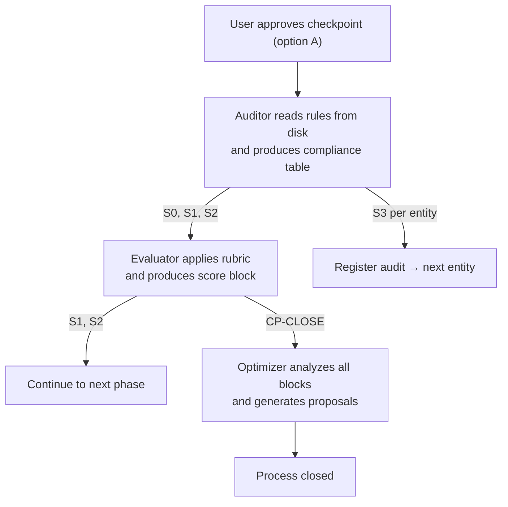

# QA System

> The Quality Assurance layer built into AiAgentArchitect — and every system it generates.

AiAgentArchitect doesn't just produce files. It produces systems that continuously self-audit. Every output passes through a structured QA cycle that runs automatically after each approved checkpoint, without user intervention and without slowing down the creative process.

This document explains how that cycle works.

---

## Design Principles

The QA layer is built on three constraints that cannot be violated:

**External** — QA is never part of the creative process. It observes and measures from the outside. No QA agent can modify, suggest rewrites, or make decisions about the system being audited.

**Non-blocking** — QA never stops execution unless there is a destructive structural failure. Its function is to accumulate a compliance trail and surface deviations, not to gate the workflow.

**Append-only** — Every audit, score, and proposal is appended to the report, never overwritten. This creates a chronological log that survives across sessions and can be analyzed for patterns.

---

## The Three Roles

The QA cycle involves three distinct roles. Each has a precise scope it cannot exceed.

### Auditor

Activates after each phase is approved. Its only job is to answer one question: _did this output comply with the active rules?_

It reads the rules from disk at the moment of auditing — never from memory. It cross-references the output against each rule's hard and soft constraints, and produces a compliance table with three possible statuses per criterion: ✅ passed, ⚠️ alert, or ❌ failure.

The Auditor **cannot** modify files, suggest better content, or evaluate quality. It only reports compliance.

### Evaluator

Activates after the Auditor in phases S1 and S2, and independently at the close of the process. Its job is to answer: _how well did this phase perform?_

It takes the Auditor's compliance report and the phase context, applies a weighted scoring rubric, and produces a score block. At process close, it aggregates all phase scores into a global scorecard.

The Evaluator **cannot** modify entities or issue qualitative judgements. It only calculates scores based on evidence.

### Optimizer

Activates at process close, after the Evaluator produces the global scorecard. It reads the complete report — all audit blocks and all scores — detects recurring failure and success patterns, and generates prioritized improvement proposals.

Each proposal references a specific target and describes a concrete change. The Optimizer **cannot** apply any proposal. Every modification requires explicit user decision.

---

## Automatic Activation Cycle

The cycle triggers automatically on checkpoint approval (option A). It never runs on adjustment (B), regeneration (C), or backtrack (D).



| Event             | Roles activated       | Output                                    |
| ----------------- | --------------------- | ----------------------------------------- |
| CP-S0 approved    | Auditor → Evaluator   | Audit block + Score block for S0          |
| CP-S1 approved    | Auditor → Evaluator   | Audit block + Score block for S1          |
| CP-S2 approved    | Auditor → Evaluator   | Audit block + Score block for S2          |
| CP-S3-N approved  | Auditor               | Audit block for entity N                  |
| CP-CLOSE approved | Evaluator → Optimizer | Global scorecard + Optimization proposals |

---

## The Scoring Rubric

Every phase is scored on four dimensions. Scores range from 0 to 10.

| Dimension        | Weight | What it measures                                                  |
| ---------------- | ------ | ----------------------------------------------------------------- |
| **Completeness** | 30%    | Does the output contain all required elements for this phase?     |
| **Quality**      | 30%    | Is the content specific and contextualized, not generic or vague? |
| **Compliance**   | 25%    | How many audit criteria passed without alerts or failures?        |
| **Efficiency**   | 15%    | How many regenerations or iterations did the process require?     |

**Formula:** `Score = (Completeness × 0.30) + (Quality × 0.30) + (Compliance × 0.25) + (Efficiency × 0.15)`

### Efficiency reference

| Regenerations | Efficiency score |
| ------------- | ---------------- |
| 0             | 10.0             |
| 1             | 8.0              |
| 2             | 6.0              |
| 3             | 4.0              |
| 4             | 2.0              |
| ≥ 5           | 1.0              |

Adjustment iterations (checkpoint option B, without regenerating from scratch) count as 0.3 each.

### Automatic penalties

- ❌ Hard Constraint violated in audit: −1.0 point in Compliance per failure
- Unfilled placeholders detected in output: −0.5 in Quality per instance

### Quality levels

| Score     | Level          | Interpretation                                      |
| --------- | -------------- | --------------------------------------------------- |
| ≥ 8.0     | **Excellent**  | Few or no urgent improvements                       |
| 6.0 – 7.9 | **Good**       | Functional result with non-critical opportunities   |
| 4.0 – 5.9 | **Improvable** | Problematic patterns worth addressing               |
| < 4.0     | **Critical**   | Structural failures — the Optimizer issues an alert |

### Global scorecard

At process close, phases are weighted differently to reflect their impact on the final output:

| Phase                      | Weight | Justification                                                  |
| -------------------------- | ------ | -------------------------------------------------------------- |
| S1 — Process Discovery     | 25%    | Errors here are usually detected and corrected in S2           |
| S2 — Architecture Design   | 35%    | Defines the full structure — errors carry over to S3           |
| S3 — Entity Implementation | 40%    | The actual deliverable — errors here directly affect usability |

**Global formula:** `Global = (S1 × 0.25) + (S2 × 0.35) + (S3 × 0.40)`

> In Express Mode (without a formal S2 phase), weights redistribute to S1=35%, S3=65%.

---

## Report Anatomy

All QA output lives in a single `qa-report.md` file at the root of the generated system directory. Each audit, score, and proposal block is appended chronologically — the system never overwrites or deletes previous blocks. Cross-session history is accumulated in `qa-meta-report.md`.

### Audit block

```markdown
## [Audit S2] — 2026-03-04 22:35:00

**System:** assistant-documentation-generator
**Audited phase:** S2 — Architecture Design
**Rules verified:** rul-naming-conventions, rul-checkpoint-behavior

| Criterion                 | Rule                    | Status | Evidence                         |
| ------------------------- | ----------------------- | ------ | -------------------------------- |
| Correct prefix in names   | rul-naming-conventions  | ✅     | All entities follow prefix-kebab |
| Checkpoint with 4 options | rul-checkpoint-behavior | ⚠️     | CP-S2 missing option D           |
| Character limit respected | rul-naming-conventions  | ✅     | Longest entity: 3,840 chars      |

**Summary:** 3 criteria verified — ✅ 2 passed / ⚠️ 1 alert / ❌ 0 failures
```

### Score block

```markdown
### Score S2 — 2026-03-04 22:35:01

| Dimension    | Score | Weight | Partial |
| ------------ | ----- | ------ | ------- |
| Completeness | 9.0   | 30%    | 2.70    |
| Quality      | 8.5   | 30%    | 2.55    |
| Compliance   | 7.5   | 25%    | 1.87    |
| Efficiency   | 8.0   | 15%    | 1.20    |

**Score S2: 8.32 / 10 — Excellent**

_Metrics: 1 regeneration, 0 adjustment iterations_
```

### Optimization proposals block

```markdown
## Optimization Proposals — 2026-03-04 22:36:00

**Detected failure patterns:**

- Checkpoint option D missing in 2/3 phases (⚠️ recurring)

**Success patterns:**

- Completeness: average 9.0 — Discovery captures all required inputs

#### #1 — High priority

**Target:** rul-checkpoint-behavior
**Problem:** Option D omitted in CP-S1 and CP-S2
**Proposal:** Convert the checkpoint format into a mandatory literal template inside the rule
**Expected impact:** Eliminate 100% of missing-option occurrences
```

---

## How QA Embeds in Generated Systems

Every system generated by AiAgentArchitect includes the QA layer as a native component — not as an optional add-on.

During the packaging step, the QA layer is injected automatically into the exported system. This means:

- The generated orchestrator workflow has QA hooks wired into every checkpoint
- The three QA roles (Auditor, Evaluator, Optimizer) are present and active in the export
- The `qa-report.md` file is initialized on first audit run
- A `qa-meta-report.md` accumulates global scores across sessions, giving the Optimizer historical context on the second run and beyond

The level of QA detail in a generated system scales with its complexity. Simple systems (Express Mode) get a lighter cycle; complex multi-agent systems (Architect Mode) get the full Auditor → Evaluator → Optimizer chain.

---

## Available Commands

These commands can be used at any point during an active process session:

### `/re-audit [target]`

Triggers an on-demand audit of a specific entity, phase, or the full system. The result is appended to the current report as a `[Re-audit — {target} — {timestamp}]` block. Previous audit history is never affected.

```
/re-audit S2                     → re-audits the entire S2 phase with current content
/re-audit rul-naming-conventions → re-audits that specific rule file
/re-audit system                 → re-audits all generated entities
```

### `/skip-qa [phase]`

Skips the QA cycle for a specific phase. The omission is recorded in the report immediately:

```markdown
## [QA Skipped — S1] — 2026-03-04 22:35:00

_The user skipped the QA cycle for this phase._
```

Skipping QA is always logged. The audit trail remains complete even when phases are omitted.

---

## Extending the QA Layer

The QA layer is designed to be adjusted without breaking existing behavior.

### Adjusting scoring weights

Weights per dimension (Completeness, Quality, Compliance, Efficiency) and per phase (S1, S2, S3) can be modified in the evaluation criteria knowledge base. Changes take effect immediately — no restart required — because the Evaluator always reads criteria at evaluation time, not from a cached version.

The system enforces one constraint: weights per rubric must always sum to 100%.

### Adding new audit criteria

New compliance rules can be introduced by creating a rule file following the `rul-` naming convention. The Auditor discovers active rules dynamically at audit time, reading from disk rather than relying on a hardcoded list. This means a new rule file is picked up automatically on the next audit run — no wiring changes needed in the Auditor itself.

Rule files must define:

- **Hard Constraints** — violations that produce a ❌ and trigger a Compliance penalty
- **Soft Constraints** — deviations that produce a ⚠️ without score penalty

### Adjusting quality level thresholds

The four quality levels (Critical, Improvable, Good, Excellent) and their score boundaries can be adjusted in the evaluation criteria. The Optimizer uses these thresholds to decide when to issue alerts and how to prioritize proposals.

---

## Related Documentation

- [USAGE.md](USAGE.md) — Full pipeline walkthrough, checkpoint reference, and Express vs Architect mode comparison
- [DUAL-SYSTEM.md](DUAL-SYSTEM.md) — How the dual `.agents/` / `.claude/` sync works
