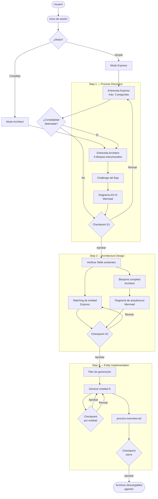

# Agentic Architect

## Descripción del proceso

El sistema **Agentic Architect** es un proceso completo para transformar cualquier necesidad —desde una entidad aislada hasta un proceso complejo multi-agente— en un conjunto de archivos de instrucciones funcionales, correctamente especificados y listos para usar.

El proceso se articula en tres fases secuenciales: **discovery** del proceso o entidad a crear, **diseño arquitectónico** de las entidades necesarias, e **implementación** de los archivos de instrucciones. Cada fase termina con un checkpoint de validación explícita antes de continuar.

El sistema opera en dos modos según la complejidad detectada. El **Modo Express** reduce el proceso al mínimo necesario para entidades simples (un Agent, una Skill, un Command, una Rule), con un máximo de 5 preguntas en el discovery y sin diseño arquitectónico extenso. El **Modo Architect** aplica el proceso completo con entrevista estructurada por bloques, diagramas AS-IS y de arquitectura, y Blueprint detallado, para procesos que requieren múltiples entidades coordinadas. El sistema puede escalar automáticamente de Express a Architect si detecta complejidad oculta durante el discovery.

El output del sistema son archivos generados en `exports/{nombre}/google-antigravity/.agent/` por defecto, listos para usar en Google Antigravity. Opcionalmente, el sistema puede exportar a otras plataformas (Claude Code, ChatGPT, etc.) usando `ski-platform-exporter`.

## Diagrama de flujo

## Arquitectura de entidades

### Inventario

| Entidad                         | Tipo             | Archivo                                               | Función                                                                                                        |
| ------------------------------- | ---------------- | ----------------------------------------------------- | -------------------------------------------------------------------------------------------------------------- |
| `wor-agentic-architect`         | Workflow         | `agentic/workflows/wor-agentic-architect.md`          | Orquesta las 3 fases, gestiona modos, checkpoints y paso de contexto entre fases                               |
| `age-spe-process-discovery`     | Agent Specialist | `agentic/agents/age-spe-process-discovery.md`         | Entrevista al usuario, aplica BPM/BPA e ingeniería inversa, genera el diagrama AS-IS                           |
| `age-spe-architecture-designer` | Agent Specialist | `agentic/agents/age-spe-architecture-designer.md`     | Analiza el proceso descubierto, selecciona entidades y genera el Blueprint arquitectónico                      |
| `age-spe-entity-builder`        | Agent Specialist | `agentic/agents/age-spe-entity-builder.md`            | Genera los archivos de cada entidad uno a uno siguiendo las especificaciones de formato                        |
| `age-spe-auditor`               | Agent Specialist | `agentic/agents/age-spe-auditor.md`                   | QA Layer: audita cumplimiento de reglas e instrucciones tras cada checkpoint aprobado                          |
| `age-spe-evaluator`             | Agent Specialist | `agentic/agents/age-spe-evaluator.md`                 | QA Layer: puntúa por rúbrica ponderada y genera el qa-report.md acumulativo                                    |
| `age-spe-optimizer`             | Agent Specialist | `agentic/agents/age-spe-optimizer.md`                 | QA Layer: detecta patrones en el qa-report.md y propone mejoras priorizadas al sistema                         |
| `ski-process-interviewer`       | Skill            | `agentic/skills/ski-process-interviewer/SKILL.md`     | Protocolo de entrevista estructurada con bloques BPM/BPA e ingeniería inversa                                  |
| `ski-diagram-generator`         | Skill            | `agentic/skills/ski-diagram-generator/SKILL.md`       | Genera diagramas Mermaid para procesos AS-IS y arquitecturas de entidades                                      |
| `ski-entity-selector`           | Skill            | `agentic/skills/ski-entity-selector/SKILL.md`         | Aplica el árbol de decisión para seleccionar el tipo correcto de cada entidad                                  |
| `ski-entity-file-builder`       | Skill            | `agentic/skills/ski-entity-file-builder/SKILL.md`     | Genera archivos `.md` con el formato correcto según tipo y nivel de intricacy                                  |
| `ski-platform-exporter`         | Skill            | `agentic/skills/ski-platform-exporter/SKILL.md`       | Convierte exports de Antigravity a otras plataformas (Claude Code, ChatGPT, etc.)                              |
| `ski-compliance-checker`        | Skill            | `agentic/skills/ski-compliance-checker/SKILL.md`      | QA Layer: lee Rules desde disco y verifica el output de cada fase contra sus criterios                         |
| `ski-rubric-scorer`             | Skill            | `agentic/skills/ski-rubric-scorer/SKILL.md`           | QA Layer: aplica rúbrica ponderada para calcular scores por dimensión                                          |
| `ski-pattern-analyzer`          | Skill            | `agentic/skills/ski-pattern-analyzer/SKILL.md`        | QA Layer: detecta patrones de fallo/éxito en los bloques del qa-report.md                                      |
| `ski-qa-embed`                  | Skill            | `agentic/skills/ski-qa-embed/SKILL.md`                | QA Layer: embebe el sistema QA completo en sistemas recién generados                                           |
| `rul-naming-conventions`        | Rule             | `agentic/rules/rul-naming-conventions.md`             | Prefijos, kebab-case, límites de caracteres y rutas relativas. Always on                                       |
| `rul-checkpoint-behavior`       | Rule             | `agentic/rules/rul-checkpoint-behavior.md`            | Formato estándar de checkpoints y gestión de validaciones. Always on                                           |
| `rul-interview-standards`       | Rule             | `agentic/rules/rul-interview-standards.md`            | Una pregunta a la vez, estándares de calidad de respuesta, protocolo de challenge. Always on                   |
| `rul-audit-behavior`            | Rule             | `agentic/rules/rul-audit-behavior.md`                 | QA Layer: cuándo se activa el ciclo QA, responsabilidades por agente, comandos /re-audit y /skip-qa. Always on |
| `kno-fundamentals-entities`     | Knowledge-base   | `agentic/knowledge-base/kno-fundamentals-entities.md` | Definición, activación, atributos y especificaciones de las 6 entidades                                        |
| `kno-entity-selection`          | Knowledge-base   | `agentic/knowledge-base/kno-entity-selection.md`      | Árbol de decisión, tabla comparativa, casos límite y anti-patrones                                             |
| `kno-system-architecture`       | Knowledge-base   | `agentic/knowledge-base/kno-system-architecture.md`   | Arquitectura root folder, formatos de exportación y arquitectura dual                                          |
| `kno-evaluation-criteria`       | Knowledge-base   | `agentic/knowledge-base/kno-evaluation-criteria.md`   | QA Layer: criterios, pesos y umbrales de la rúbrica de evaluación                                              |
| `kno-qa-layer-template`         | Knowledge-base   | `agentic/knowledge-base/kno-qa-layer-template.md`     | QA Layer: plantillas parametrizables para embeber el QA en sistemas nuevos                                     |
| `kno-qa-dynamic-reading`        | Knowledge-base   | `agentic/knowledge-base/kno-qa-dynamic-reading.md`    | QA Layer: protocolo de lectura dinámica de archivos desde disco                                                |

### Relaciones

**Workflow → Agents:** `wor-agentic-architect` invoca a los tres Agents Specialist en secuencia según la fase activa. Transfiere contexto entre fases mediante JSON de handoff: el output de `age-spe-process-discovery` es el input de `age-spe-architecture-designer`, y el output de este es el input de `age-spe-entity-builder`.

**Agents → Skills:** `age-spe-process-discovery` usa `ski-process-interviewer` para estructurar la entrevista y `ski-diagram-generator` para el diagrama AS-IS. `age-spe-architecture-designer` usa `ski-entity-selector` para seleccionar entidades y `ski-diagram-generator` para el diagrama de arquitectura. `age-spe-entity-builder` usa `ski-entity-file-builder` para generar cada archivo y `ski-diagram-generator` para los diagramas del process-overview.

**Workflow → Skills:** `wor-agentic-architect` usa `ski-platform-exporter` post-empaquetado para generar exports opcionales a otras plataformas.

**Entidades → Rules:** Las tres Rules están marcadas como `always_on` y condicionan el comportamiento de todas las entidades del sistema. `rul-naming-conventions` aplica en todo momento en que se nombre o referencie una entidad. `rul-checkpoint-behavior` aplica en cada checkpoint del Workflow y del Entity Builder. `rul-interview-standards` aplica durante toda la ejecución del Process Discovery.

**Agents → Knowledge-bases:** `age-spe-process-discovery` consulta `kno-fundamentals-entities` y `kno-entity-selection` para detectar señales de escalado. `age-spe-architecture-designer` consulta las tres Knowledge-bases para seleccionar entidades, definir el Blueprint y asignar rutas correctas. `age-spe-entity-builder` consulta `kno-fundamentals-entities` para las plantillas de formato y `kno-system-architecture` para las rutas relativas.

### Diagrama de arquitectura

```mermaid
flowchart TD
    U([Usuario])

    subgraph "Workflow"
        WF[wor-agentic-architect]
    end

    subgraph "Agents"
        AG1[age-spe-process-discovery]
        AG2[age-spe-architecture-designer]
        AG3[age-spe-entity-builder]
    end

    subgraph "QA Layer"
        AUD[age-spe-auditor]
        EVA[age-spe-evaluator]
        OPT[age-spe-optimizer]
    end

    subgraph "Skills"
        SK1[ski-process-interviewer]
        SK2[ski-diagram-generator]
        SK3[ski-entity-selector]
        SK4[ski-entity-file-builder]
        SK5[ski-compliance-checker]
        SK6[ski-rubric-scorer]
        SK7[ski-pattern-analyzer]
        SK8[ski-qa-embed]
    end

    subgraph "Rules — always on"
        RUL1[rul-naming-conventions]
        RUL2[rul-checkpoint-behavior]
        RUL3[rul-interview-standards]
        RUL4[rul-audit-behavior]
    end

    subgraph "Knowledge-base"
        KB1[(kno-fundamentals-entities)]
        KB2[(kno-entity-selection)]
        KB3[(kno-system-architecture)]
        KB4[(kno-evaluation-criteria)]
        KB5[(kno-qa-layer-template)]
        KB6[(kno-qa-dynamic-reading)]
    end

    QR[(qa-report.md)]
    OUT([Archivos agentic/])
    EMBED([Sistema nuevo + QA Layer])

    U -->|input| WF
    WF -->|Step 1| AG1
    WF -->|Step 2| AG2
    WF -->|Step 3| AG3

    AG1 -->|usa| SK1
    AG1 -->|usa| SK2
    AG2 -->|usa| SK3
    AG2 -->|usa| SK2
    AG3 -->|usa| SK4
    AG3 -->|usa| SK2

    AG1 -.->|consulta| KB1
    AG1 -.->|consulta| KB2
    AG2 -.->|consulta| KB1
    AG2 -.->|consulta| KB2
    AG2 -.->|consulta| KB3
    AG3 -.->|consulta| KB1
    AG3 -.->|consulta| KB3

    WF -.->|post-CP-S1,S2| AUD
    WF -.->|post-CP-S1,S2,CIERRE| EVA
    WF -.->|post-CP-CIERRE| OPT

    AUD --> SK5
    EVA --> SK6
    OPT --> SK7
    AUD & EVA & OPT --> QR

    WF -->|post-empaquetado| SK8
    SK8 --> EMBED

    RUL1 -. always on .-> WF
    RUL2 -. always on .-> WF
    RUL3 -. always on .-> AG1
    RUL4 -. always on .-> AUD

    AG3 --> OUT
    WF -->|output| U
```

## Criterios de éxito

El sistema habrá funcionado correctamente si:

- El usuario aprueba todos los checkpoints sin necesidad de regeneraciones múltiples en ninguna fase.
- Los archivos generados cumplen el formato especificado para su tipo de entidad y se ubican correctamente en `exports/{nombre}/google-antigravity/.agent/` sin ajustes manuales.
- El export a Google Antigravity está listo para usar inmediatamente.
- El modo seleccionado (Express o Architect) es apropiado para la complejidad real del proceso.
- En Modo Architect, el diagrama AS-IS ha sido validado por el usuario antes de cerrar el Step 1, y el Blueprint ha sido aprobado antes de iniciar el Step 3.
- No hay referencias cruzadas rotas entre entidades generadas.
- Si se solicitan exports adicionales, `ski-platform-exporter` genera las estructuras correctas para cada plataforma.
- Este documento permite entender el sistema y su arquitectura sin necesidad de leer cada entidad individualmente.
