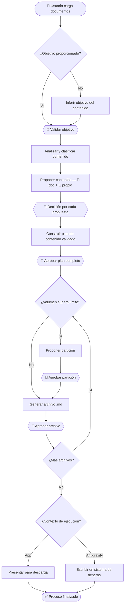

# Agentic Architect — Template Architect

Rellena este template antes de iniciar la sesión. Cuanto más completo llegues, menos preguntas necesitará el sistema en el Step 1 y más rápido llegarás al diseño arquitectónico.

No te preocupes si no tienes todas las respuestas. Deja en blanco lo que no sepas — el sistema lo trabajará contigo durante la entrevista.

---

## 1. Qué quieres agentizar

**Nombre o título del proceso:**
_(puede ser informal)_

Assistant documentation generator

**Describe el proceso en 2-4 frases:**
_(qué problema resuelve, qué hace, cuál es su objetivo)_

El objetivo es crear un sistema agéntico que me ayude a transformar N inputs en documentos preparados para ser empleados en los sistemas agénticos que yo cree.

Sistema que transforma documentos de cualquier formato en archivos .md de
- knowledge-base
- rules
- resources
correctamente estructurados, optimizados para ser interpretados por agentes de IA. El sistema analiza los documentos, infiere el objetivo del proceso si no se ha proporcionado, clasifica el
contenido por tipo de entidad, y propone enriquecimiento desde su propio conocimiento cuando detecta gaps relevantes — diferenciando siempre la fuente de cada propuesta. El usuario mantiene control total mediante validaciones explícitas en cada fase antes de que se genere nada.

estos elementos seguirán las instrucciones y pautas que tenemos definidos oara ellos en ".agents" de este sistema, así nos aseguramos de que estén preparados para ser utilizados en sistemas futuros.

el sistema tendrá en su raíz, al mismo nivel de ".agents/" lo siguiente
- docs
	- {documentation-title}
		- input/ -> donde cargaré los archivos y documentación original
			- input.md -> donde describiré el objetivo y lo que estoy cargando, necesito que generes una plantilla para esto
		- output/
			- knowledge-base/ -> donde se exportarán los archivos md de knowledge-base
			- rules/ -> donde se exportarán los archivos md de rules
			- resources/ -> donde se exportarán los archivos md de resources
			- {documentation-title}-overview.md -> donde se especificará un resumen, documentos y sus relaciones

Diagrama de flujo




Criterios de éxito

- El objetivo del proceso ha sido validado explícitamente por el usuario antes de iniciar cualquier análisis.
- Cada propuesta de contenido tiene fuente identificada y decisión explícita del usuario registrada.
- Todos los archivos generados siguen las especificaciones que están definidas dentro de .agents
- Ningún archivo supera el límite máximo de caracteres.
- Los archivos particionados contienen referencias cruzadas correctas.
- Los archivos han sido exportados o presentados para descarga correctamente según la plataforma de ejecución.


**¿Cómo se hace esto hoy, sin el sistema?**
_(flujo manual actual, aunque sea aproximado)_

Cargo directamente el pdf o documento correspondiente o directamente no lo cargo.

**¿Qué pasa si el sistema no existe o falla?**
_(impacto o coste de no tenerlo)_

Qué no tengo knowledge base o rules o las tengo pero están mal estructuradas.

---

## 2. Flujo del proceso

**¿Cómo empieza el proceso?**
_(qué lo dispara: un usuario, un evento, un email, un cron job, un webhook...)_

lo expliqué antes

**Pasos principales que ya tienes identificados:**
_(no tienen que ser perfectos ni completos, escribe lo que sepas)_

```
1.
2.
3.
4.
...
```

**¿Cómo termina el proceso?**
_(qué produce al finalizar y a quién o qué va ese output)_


**¿Hay decisiones o bifurcaciones en el flujo?**
_(puntos donde el proceso toma un camino u otro según alguna condición)_


**¿Hay pasos que se repiten?**
_(bucles o iteraciones)_

---

## 3. Contexto técnico

**¿El proceso interactúa con sistemas externos?**
_(CRMs, APIs, bases de datos, email, Slack, herramientas internas...)_

| Sistema | ¿Qué información se lee? | ¿Qué información se escribe? |
|---|---|---|
| | | |
| | | |

**¿Hay puntos donde un humano debe revisar o aprobar antes de continuar?**
_(aprobaciones, validaciones manuales, checkpoints de control)_


**¿Hay acciones irreversibles en el proceso?**
_(enviar un email, hacer un pago, borrar datos...)_


---

## 4. Skills y entidades existentes _(opcional)_

**¿Tienes Skills ya creadas que podrían reutilizarse en este proceso?**
_(lista sus nombres o describe qué hacen)_


**¿Hay procesos similares ya agentizados que pueda tomar como referencia?**


---

## 5. Restricciones conocidas _(opcional)_

**¿Hay algo que el sistema nunca deba hacer?**


**¿Hay restricciones legales, de negocio o técnicas relevantes?**


**¿Hay información de referencia que el sistema deba conocer?**
_(documentación, guías de estilo, datos del dominio, ejemplos...)_


---

## 6. Resultado esperado _(opcional)_

**¿Cómo se ve el éxito cuando el sistema funciona correctamente?**


**¿Hay métricas o criterios concretos para saber que funciona bien?**


---

_Pega el contenido de este template al inicio de la conversación con el Agentic Architect._
