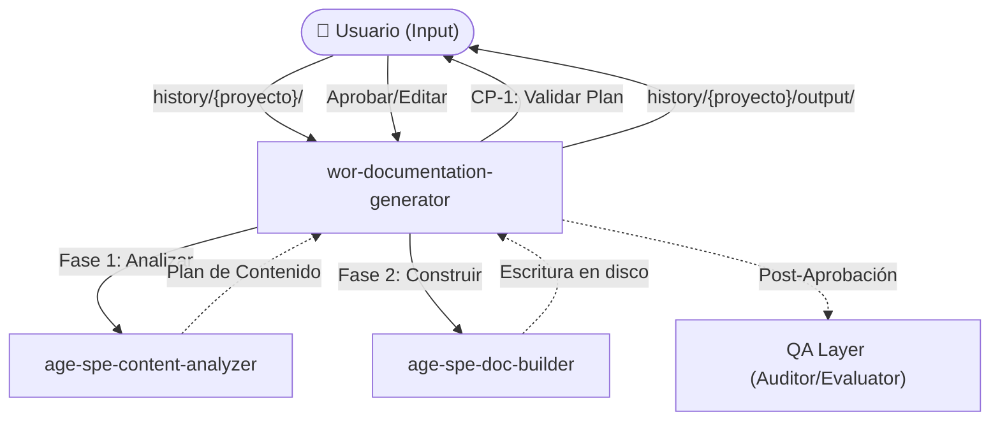

# Assistant Documentation Generator

## Descripción del proceso

El **Assistant Documentation Generator** es un sistema agéntico diseñado para transformar documentos en bruto (PDFs, textos aislados, notas) en una colección de archivos Markdown perfectamente estructurados para su uso como contexto por parte de agentes de IA. Divide la información y genera tres tipos de archivos base: Knowledge-Bases estáticas (`kno-`), Reglas de comportamiento (`rul-`) y Recursos de datos masivos (`res-`).

El proceso prima la facilidad de uso minimizando la fricción humana. El usuario solo rellena un archivo de configuración (`kno-input-template.md`) en su carpeta de historial y el sistema realiza todo el análisis, proponiendo un **Plan de Contenido Trazable** donde diferencia el contenido original de las inferencias añadidas, garantizando que ninguna información valiosa se descarte sin justificación. Tras una única aprobación, materializa físicamente la estructura de salida.

## Diagrama de flujo

## Arquitectura de entidades

### Inventario

| Entidad                       | Tipo     | Plataforma Claude Code                              | Función                                                         |
| ----------------------------- | -------- | --------------------------------------------------- | --------------------------------------------------------------- |
| `wor-documentation-generator` | Workflow | `.claude/commands/wor-documentation-generator.md`   | Orquesta la transformación de documentos de principio a fin     |
| `age-spe-content-analyzer`    | Agent    | `.claude/agents/age-spe-content-analyzer.md`        | Clasifica input, propone enriquecimientos y descarta ruido      |
| `age-spe-doc-builder`         | Agent    | `.claude/agents/age-spe-doc-builder.md`             | Genera los archivos .md respetando los límites y el formato     |
| `ski-content-chunker`         | Skill    | `.claude/skills/ski-content-chunker.md`             | Particiona documentos masivos preservando la semántica          |
| `kno-entity-format-specs`     | KB       | `.claude/knowledge-base/kno-entity-format-specs.md` | Especificaciones estrictas sobre cada tipo de archivo de salida |
| `kno-input-template`          | KB       | `.claude/knowledge-base/kno-input-template.md`      | Definición de los campos requeridos en el archivo inicial       |
| `rul-output-standards`        | Rule     | `.claude/rules/rul-output-standards.md`             | Constraints de volumen, nombres de archivo y prefijos           |
| `rul-source-attribution`      | Rule     | `.claude/rules/rul-source-attribution.md`           | Obliga a marcar fuente (📄 original vs 🧠 inferencia)           |
| `res-input-template`          | Resource | `.claude/resources/res-input-template.md`           | Plantilla base de kno-input-template.md que rellena el usuario  |
| `age-spe-auditor`             | Agent    | `.claude/agents/age-spe-auditor.md`                 | (QA) Verifica el cumplimiento de las reglas del sistema         |
| `age-spe-evaluator`           | Agent    | `.claude/agents/age-spe-evaluator.md`               | (QA) Genera score cards y alimenta el qa-report                 |
| `age-spe-optimizer`           | Agent    | `.claude/agents/age-spe-optimizer.md`               | (QA) Analiza patrones y propone mejoras al sistema              |
| `ski-compliance-checker`      | Skill    | `.claude/skills/ski-compliance-checker.md`          | (QA) Skill analítica de auditoría estricta                      |
| `ski-rubric-scorer`           | Skill    | `.claude/skills/ski-rubric-scorer.md`               | (QA) Cálculo matemático de scores de evaluación                 |
| `ski-pattern-analyzer`        | Skill    | `.claude/skills/ski-pattern-analyzer.md`            | (QA) Detección de patrones en reportes acumulados               |
| `rul-audit-behavior`          | Rule     | `.claude/rules/rul-audit-behavior.md`               | (QA) Reglas sobre el comportamiento analítico del QA Layer      |
| `kno-qa-dynamic-reading`      | KB       | `.claude/knowledge-base/kno-qa-dynamic-reading.md`  | (QA) Resolución de rutas para lectura en caliente               |

## Criterios de éxito

- El workflow comienza asimilando correctamente la configuración y documentos brutos sin pérdida de contexto por ventanas de memoria.
- El usuario solo debe actuar en un punto de validación humana (Check Point 1: Plan de contenido), maximizándose su tiempo y evitándose interrupciones mecánicas.
- Todo concepto mayor omitido del original tiene su justificación visible. Toda viñeta de inferencia tiene la etiqueta cerebral (`🧠`).
- Los archivos finalmente escritos existen físicamente agrupados, son Markdown sintácticamente puro, y ningún archivo viola los topes absolutos estipulados por el estándar (`rul-output-standards`).
