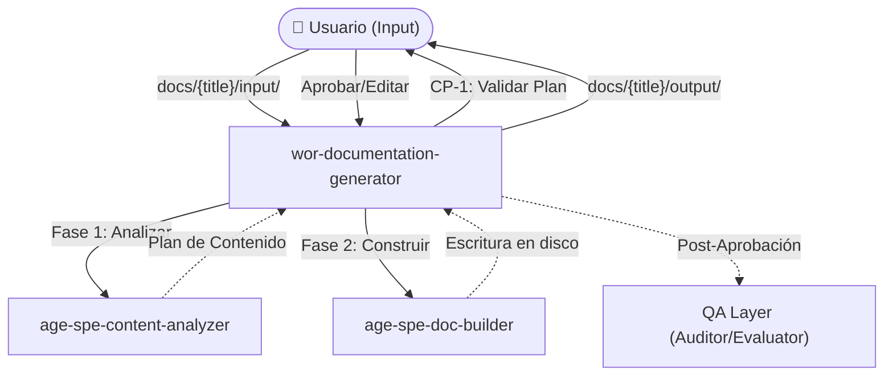

# Assistant Documentation Generator

## Descripción del proceso

El **Assistant Documentation Generator** es un sistema agéntico diseñado para transformar documentos en bruto (PDFs, textos aislados, notas) en una colección de archivos Markdown perfectamente estructurados para su uso como contexto por parte de agentes de IA. Divide la información y genera tres tipos de archivos base: Knowledge-Bases estáticas (`kno-`), Reglas de comportamiento (`rul-`) y Recursos de datos masivos (`res-`).

El proceso prima la facilidad de uso minimizando la fricción humana. El usuario solo rellena un archivo de configuración (`input.md`) y el sistema realiza todo el análisis, proponiendo un **Plan de Contenido Trazable** donde diferencia el contenido original de las inferencias añadidas, garantizando que ninguna información valiosa se descarte sin justificación. Tras una única aprobación, materializa físicamente la estructura de salida.

## Diagrama de flujo



## Arquitectura de entidades

### Inventario

| Entidad                       | Tipo     | Archivo                                       | Función                                                         |
| ----------------------------- | -------- | --------------------------------------------- | --------------------------------------------------------------- |
| `wor-documentation-generator` | Workflow | `./workflows/wor-documentation-generator.md`  | Orquesta la transformación de documentos de principio a fin     |
| `age-spe-content-analyzer`    | Agent    | `./workflows/age-spe-content-analyzer.md`     | Clasifica input, propone enriquecimientos y descarta ruido      |
| `age-spe-doc-builder`         | Agent    | `./workflows/age-spe-doc-builder.md`          | Genera los archivos .md respetando los límites y el formato     |
| `ski-content-chunker`         | Skill    | `./skills/ski-content-chunker/SKILL.md`       | Particiona documentos masivos preservando la semántica          |
| `kno-entity-format-specs`     | KB       | `./knowledge-base/kno-entity-format-specs.md` | Especificaciones estrictas sobre cada tipo de archivo de salida |
| `kno-input-template`          | KB       | `./knowledge-base/kno-input-template.md`      | Definición de los campos requeridos en el archivo inicial       |
| `rul-output-standards`        | Rule     | `./rules/rul-output-standards.md`             | Constraints de volumen, nombres de archivo y prefijos           |
| `rul-source-attribution`      | Rule     | `./rules/rul-source-attribution.md`           | Obliga a marcar fuente (📄 original vs 🧠 inferencia)           |
| `res-input-template`          | Resource | `./resources/res-input-template.md`           | Plantilla base de input.md que rellena el usuario               |
| `age-spe-auditor`             | Agent    | `./workflows/age-spe-auditor.md`              | (QA) Verifica el cumplimiento de las reglas del sistema         |
| `age-spe-evaluator`           | Agent    | `./workflows/age-spe-evaluator.md`            | (QA) Genera score cards y alimenta el qa-report                 |
| `age-spe-optimizer`           | Agent    | `./workflows/age-spe-optimizer.md`            | (QA) Analiza patrones y propone mejoras al sistema              |
| `ski-compliance-checker`      | Skill    | `./skills/ski-compliance-checker/SKILL.md`    | (QA) Skill analítica de auditoría estricta                      |
| `ski-rubric-scorer`           | Skill    | `./skills/ski-rubric-scorer/SKILL.md`         | (QA) Cálculo matemático de scores de evaluación                 |
| `ski-pattern-analyzer`        | Skill    | `./skills/ski-pattern-analyzer/SKILL.md`      | (QA) Detección de patrones en reportes acumulados               |
| `rul-audit-behavior`          | Rule     | `./rules/rul-audit-behavior.md`               | (QA) Reglas sobre el comportamiento analítico del QA Layer      |
| `kno-qa-dynamic-reading`      | KB       | `./knowledge-base/kno-qa-dynamic-reading.md`  | (QA) Resolución de rutas para lectura en caliente               |

### Relaciones

- **El orquestador (`wor-documentation-generator`)** domina el flujo. Es activado por el usuario, lee los documentos consultando la plantilla (`kno-input-template`) y coordina las dos grandes fases invocando consecutivamente a los agentes.
- **La Fase de Análisis (`age-spe-content-analyzer`)** utiliza la habilidad particionadora (`ski-content-chunker`) cuando se enfrenta a PDFs inmanejables. Debe clasificar los recortes consultando minuciosamente las especificaciones de salida (`kno-entity-format-specs`). Todo su trabajo cognitivo está condicionado por la regla de atribución (`rul-source-attribution`).
- **La Fase de Constitución (`age-spe-doc-builder`)** hereda un plan aprobado y escribe el contenido definitivo. También usa particionado si una de las secciones generadas supera los límites dictados por la regla estructural (`rul-output-standards`).
- **El QA Layer** existe como un subsistema latente que se despierta únicamente tras el checkpoint (CP-1). Lee dinámicamente (`kno-qa-dynamic-reading`) para puntuar todo lo ocurrido alimentando el `qa-report.md`.

### Diagrama de arquitectura

```mermaid
flowchart TD
    U(["👤 Usuario"])
    WF["wor-documentation-generator"]

    subgraph "QA Layer (Automático post-CP)"
        QACheckers["age-spe-auditor\nage-spe-evaluator"]
        QASkills["ski-compliance-checker\nski-rubric-scorer"]
    end

    subgraph "Agents"
        AG1["age-spe-content-analyzer"]
        AG2["age-spe-doc-builder"]
    end

    subgraph "Skills"
        SK1["ski-content-chunker"]
    end

    subgraph "Knowledge Base"
        KB1[("kno-entity-format-specs")]
        KB2[("kno-input-template")]
    end

    subgraph "Rules"
        RUL1["rul-output-standards"]
        RUL2["rul-source-attribution"]
    end

    subgraph "Resources"
        RES1["res-input-template"]
    end

    U -->|"docs/{title}/input/"| WF
    WF ==>|"1. analizar"| AG1
    WF ==>|"2. generar"| AG2
    AG1 -->|"usa"| SK1
    AG2 -->|"usa"| SK1
    AG1 -.->"consulta" KB1
    AG2 -.->"consulta" KB1
    WF -.->"consulta" KB2
    AG1 -.->"condicionado por" RUL1
    AG2 -.->"condicionado por" RUL1
    AG1 -.->"condicionado por" RUL2
    KB2 -.->"referencia" RES1
    WF -->|"output/ .md files"| U

    WF -.->|"Notificación"| QACheckers
    QACheckers -.->|"evalúa"| WF
```

## Criterios de éxito

- El workflow comienza asimilando correctamente la configuración y documentos brutos sin pérdida de contexto por ventanas de memoria.
- El usuario solo debe actuar en un punto de validación humana (Check Point 1: Plan de contenido), maximizándose su tiempo y evitándose interrupciones mecánicas.
- Todo concepto mayor omitido del original tiene su justificación visible. Toda viñeta de inferencia tiene la etiqueta cerebral (`🧠`).
- Los archivos finalmente escritos existen físicamente agrupados, son Markdown sintácticamente puro, y ningún archivo viola los topes absolutos estipulados por el estándar (`rul-output-standards`).
